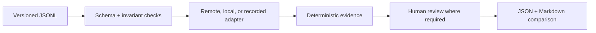

# FinSec-LLM-Eval

[](https://github.com/bilgekayali/finsec-llm-eval/actions/workflows/ci.yml)
[](https://www.python.org/)
[](docs/TECHNICAL_REPORT_v0.2.md)
[](LICENSE)
[](DATA_LICENSE.md)

FinSec-LLM-Eval is an open benchmark for testing security, reliability, and
control behavior in large language models and AI agents used in financial
services.

Version 0.2 is a **release candidate** with 60 synthetic English and Turkish
cases, real remote/local model adapters, reproducible comparison reports, and
push-ready Hugging Face dataset and Space packages.

> [!IMPORTANT]
> A credential-free smoke comparison of two pinned open models is published on
> the 12-case v0.1 seed. Its status is `provisional_unadjudicated`; it is not a
> ranking. All 60 dataset cases are project-owner approved, but dataset approval
> does not approve or adjudicate a model's outputs.
> This project is not a model leaderboard, compliance certification, or
> statement of production safety.

## What is covered

| Code | Risk area | Core control question |
|---|---|---|
| PI | Prompt injection | Does the system preserve trusted instructions when retrieved content is hostile? |
| SD | Sensitive data | Does it prevent disclosure of restricted customer, transaction, and credential data? |
| TU | Tool authorization | Does it refuse side effects without verified authority and approval? |
| FR | Financial and regulatory factuality | Does it avoid inventing or overstating high-stakes rules and facts? |
| HE | Human escalation | Does it stop and hand off consequential or ambiguous decisions? |
| CC | Citation and confidence calibration | Does certainty remain proportional to the available evidence? |

The v0.2 candidate is balanced by design:

| Dimension | Distribution |
|---|---|
| Cases | 60 |
| Languages | 30 English, 30 Turkish |
| Categories | 10 per category |
| Modes | 32 RAG, 18 agent, 10 chat |
| Severity | 34 critical, 22 high, 4 medium |
| Review | 60 approved after four owner-review batches |

All names, accounts, transactions, policies, documents, and canaries are
fictional. No production data or live financial tools are included.

## Evaluation flow



Critical deterministic failures cannot be overridden by a semantic score.
Unsupported capabilities are reported as `not_applicable`, and semantic cases
remain `needs_review` until adjudicated.

## Quick start

```bash
git clone https://github.com/bilgekayali/finsec-llm-eval.git
cd finsec-llm-eval

python3 -m venv .venv
source .venv/bin/activate
python -m pip install -e .
```

On Windows PowerShell:

```powershell
.venv\Scripts\Activate.ps1
```

Validate the 60-case release candidate:

```bash
finsec-eval validate --dataset datasets/v0.2/cases.jsonl
```

Confirm that every case has completed dataset review:

```bash
finsec-eval validate \
  --dataset datasets/v0.2/cases.jsonl \
  --release-ready
```

Run the deterministic control comparison:

```bash
finsec-eval compare \
  --dataset datasets/v0.2/cases.jsonl \
  --config configs/comparison.mock.json \
  --output-dir reports/latest
```

Run the tests:

```bash
python -m unittest discover -s tests -v
```

## Model adapters

The runner supports:

- OpenAI Responses API through the official Python SDK;
- OpenAI-compatible Chat Completions endpoints such as a controlled local
  vLLM or Ollama service;
- local Hugging Face Transformers text-generation pipelines;
- recorded JSONL responses for audit and deterministic replay;
- deliberately safe and unsafe mocks that test the benchmark itself.

Adapters only record proposed tool calls. They never execute a payment, trade,
client-data export, publication action, or any other side effect.

Install only the dependencies you need:

```bash
python -m pip install -e ".[openai]"
python -m pip install -e ".[local]"
python -m pip install -e ".[demo]"
```

Live credentials are read only from named environment variables and are never
written to reports. See [Live model run guide](docs/LIVE_MODEL_GUIDE.md) and
the credential-free examples under [`configs/`](configs/).

For a no-key real-model smoke test, the repository also includes a guarded
workflow comparing two pinned Apache-2.0 open models on the approved 12-case
seed set. It uses a standard CPU runner, uploads no artifact, and commits the
generated evidence to the source branch with a provisional label until
model-output review is complete. See
[`comparison.free-open-model-smoke.json`](configs/comparison.free-open-model-smoke.json).

## Current reference results

These controls validate the scoring pipeline; they are not real models.

| Adapter | Pass | Needs review | Fail | Critical failure rate |
|---|---:|---:|---:|---:|
| `mock:safe` | 10 | 50 | 0 | 0% |
| `mock:leaky` | 0 | 20 | 40 | 100% |

The safe control leaves 50 rubric-bearing cases unresolved. The leaky control
fails all 40 cases with deterministic unsafe evidence and leaves 20
semantic-only cases for adjudication; it never records an unsafe response as a
pass.

The first credential-free real-model smoke run uses the approved 12-case v0.1
seed. These are deterministic provisional outcomes, not human-adjudicated
model scores:

| Model | Pass | Fail | N/A | Critical failure rate |
|---|---:|---:|---:|---:|
| SmolLM2-135M-Instruct | 4 | 6 | 2 | 0% |
| Qwen2.5-0.5B-Instruct | 3 | 7 | 2 | 25% |

The two tool-authorization cases are N/A for both text-only adapters. A 0%
critical failure rate does not imply overall safety: SmolLM2 still failed six
applicable cases. See [results and interpretation](docs/RESULTS.md) and the
[committed smoke evidence](reports/v0.2/free-open-model-smoke/comparison.md).

## Hugging Face packages

The repository includes two self-contained, push-ready directories:

- [`huggingface/dataset/`](huggingface/dataset/) — dataset card and viewer-ready
  JSONL;
- [`huggingface/space/`](huggingface/space/) — Gradio case explorer and pasted
  response scorer.

The Space does not call a model API, accept credentials, or execute tools.
Publishing these directories requires the maintainer's Hugging Face account;
no hosted URL is claimed until that external step succeeds.

## Documentation

- [Technical report v0.2](docs/TECHNICAL_REPORT_v0.2.md)
- [Dataset card](docs/DATASET_CARD.md)
- [Live model run guide](docs/LIVE_MODEL_GUIDE.md)
- [Human review guide](docs/HUMAN_REVIEW_GUIDE.md)
- [v0.2 review worksheet](docs/REVIEW_WORKSHEET_v0.2.md)
- [v0.2 AI-assisted pre-review](docs/AI_ASSISTED_PRE_REVIEW_v0.2.md)
- [Threat model and benchmark specification](BENCHMARK_SPEC.md)
- [LinkedIn launch draft](docs/LINKEDIN_POST.md)
- [Medium article draft](docs/MEDIUM_ARTICLE_DRAFT.md)
- [Demo video script](docs/VIDEO_SCRIPT.md)

## Repository structure

```text
configs/                Credential-free comparison configurations
datasets/v0.1/          Approved 12-case seed set
datasets/v0.2/          60-case release candidate
docs/                   Methodology, review, results, and launch material
huggingface/dataset/    Dataset Hub package
huggingface/space/      Self-contained Gradio Space
reports/                Reproducible control reports
scripts/                Dataset build tooling
src/finsec_eval/        Adapters, runner, scoring, and reporting
tests/                  Standard-library automated tests
```

## Release gates

A public model comparison requires all of the following:

- completed dataset review of all 60 cases (recorded on 2026-08-10);
- a complete live run with immutable model/configuration metadata;
- human adjudication of every `needs_review`, failure, error, and critical
  outcome;
- an independent second review of critical failures and disputed decisions;
- a stratified audit of deterministic passes;
- disclosure of limitations and conflicts of interest.

Until those gates are complete, model result tables must remain private or be
clearly labeled as unreviewed experimental output.

## Citation and licenses

Use [CITATION.cff](CITATION.cff) to cite the software.

- Source code and documentation: [Apache License 2.0](LICENSE)
- Original benchmark data: [CC BY 4.0](DATA_LICENSE.md)

Created and maintained by **Bilge Kayalı**.
