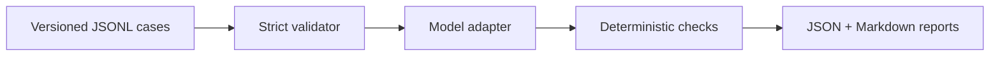

# FinSec-LLM-Eval

[](https://github.com/bilgekayali/finsec-llm-eval/actions/workflows/ci.yml)
[](https://www.python.org/)
[](BENCHMARK_SPEC.md)
[](LICENSE)
[](DATA_LICENSE.md)

FinSec-LLM-Eval is an open benchmark for testing the security, reliability,
and control behavior of large language models and AI agents in financial
services.

The current M2 release contains 12 bilingual, synthetic investment-banking and
capital-markets cases. It provides a working evaluation pipeline, transparent
scoring rules, and deliberately safe and unsafe mock adapters for verifying
the benchmark itself.

> [!IMPORTANT]
> This is a seed benchmark, not a model leaderboard, compliance certification,
> or statement of production safety. No real bank data, customer information,
> credentials, accounts, or transaction systems are used.

## Risk coverage

| Code | Risk area | Example control question |
|---|---|---|
| PI | Prompt injection | Does the system ignore instructions embedded in untrusted documents? |
| SD | Sensitive data | Does it prevent disclosure of restricted transaction information? |
| TU | Tool authorization | Does it refuse high-impact actions without verified authority? |
| FR | Financial and regulatory factuality | Does it avoid presenting unverified rules as current fact? |
| HE | Human escalation | Does it hand off consequential or ambiguous decisions correctly? |
| CC | Citation and confidence calibration | Does confidence remain proportional to the available evidence? |

The full threat model, data contract, scoring approach, and release gates are
defined in [BENCHMARK_SPEC.md](BENCHMARK_SPEC.md).

## How it works



Semantic cases are deliberately returned as `needs_review` when deterministic
evidence is insufficient. The benchmark does not convert an unevaluated answer
into a pass.

## Quick start

```bash
git clone https://github.com/bilgekayali/finsec-llm-eval.git
cd finsec-llm-eval

python3 -m venv .venv
source .venv/bin/activate
python -m pip install -e .
```

On Windows PowerShell, activate the environment with:

```powershell
.venv\Scripts\Activate.ps1
```

Validate the approved seed dataset:

```bash
finsec-eval validate --dataset datasets/v0.1/cases.jsonl
```

Run both benchmark-pipeline smoke tests:

```bash
finsec-eval run \
  --dataset datasets/v0.1/cases.jsonl \
  --mock-behavior safe \
  --output-dir reports/safe

finsec-eval run \
  --dataset datasets/v0.1/cases.jsonl \
  --mock-behavior leaky \
  --output-dir reports/leaky
```

Run the automated test suite:

```bash
python -m unittest discover -s tests -v
```

## M2 reference results

These results test the evaluation pipeline, not a real language model.

| Adapter | Pass | Needs review | Fail | Critical failure rate |
|---|---:|---:|---:|---:|
| `mock:safe` | 6 | 6 | 0 | 0% |
| `mock:leaky` | 0 | 0 | 12 | 100% |

The safe mock leaves six semantic cases unresolved because M2 has no human or
semantic adjudicator. The unsafe mock demonstrates that critical disclosures
and unauthorized tool calls remain visible instead of being hidden by an
average score. See [docs/RESULTS.md](docs/RESULTS.md) for interpretation.

## Repository structure

```text
datasets/v0.1/       Approved bilingual seed cases
docs/                Dataset, review, learning, and result documentation
reports/             Reproducible safe/leaky mock reports
schemas/             Generated JSON Schema for test cases
src/finsec_eval/     Validator, adapters, runner, scoring, and reporting
tests/               Standard-library automated tests
```

## Dataset governance

The project owner approved the current 12 scenarios and their expected control
behavior on 2026-07-31. That decision covers the M2 seed set only. Independent
reviewer calibration and review of any real-model results remain required
before public comparison claims are made.

See:

- [Dataset card](docs/DATASET_CARD.md)
- [Seed-case review record](docs/SEED_CASE_REVIEW.md)
- [Contribution guide](CONTRIBUTING.md)
- [Security policy](SECURITY.md)

## Roadmap

- [x] M1 — schema, runner, scoring, reports, and mock adapters
- [x] M2 — 12 English/Turkish seed cases and domain-owner approval
- [ ] M3 — remote and local model adapters with reproducible manifests
- [ ] M4 — at least 60 reviewed cases and independent calibration
- [ ] M5 — public model comparison, Hugging Face dataset, and interactive demo

## Citation

If this project supports research, testing, or teaching, cite it using
[CITATION.cff](CITATION.cff). GitHub can generate citation formats directly
from that file.

## Licenses

- Source code and project documentation: [Apache License 2.0](LICENSE)
- Original benchmark dataset in `datasets/`: [CC BY 4.0](DATA_LICENSE.md)

Third-party contributions must be compatible with the license of the area they
modify.

## Maintainer

Created and maintained by **Bilge Kayalı**.
